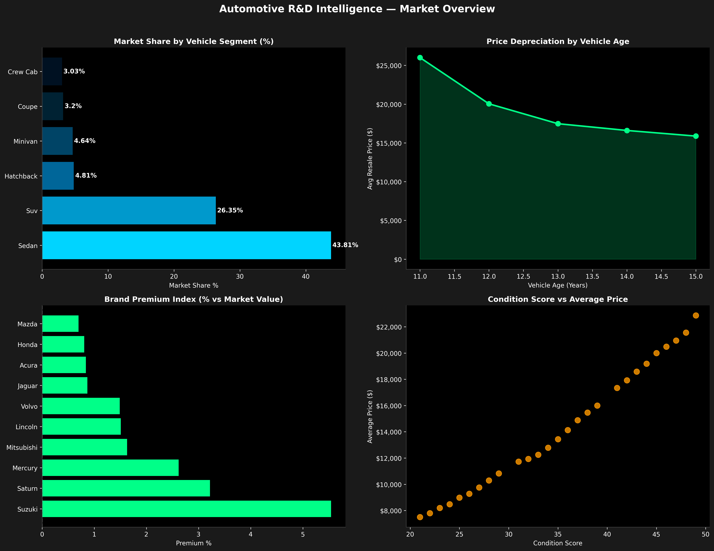
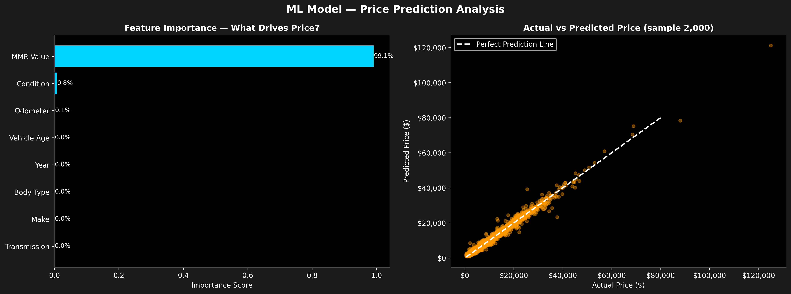
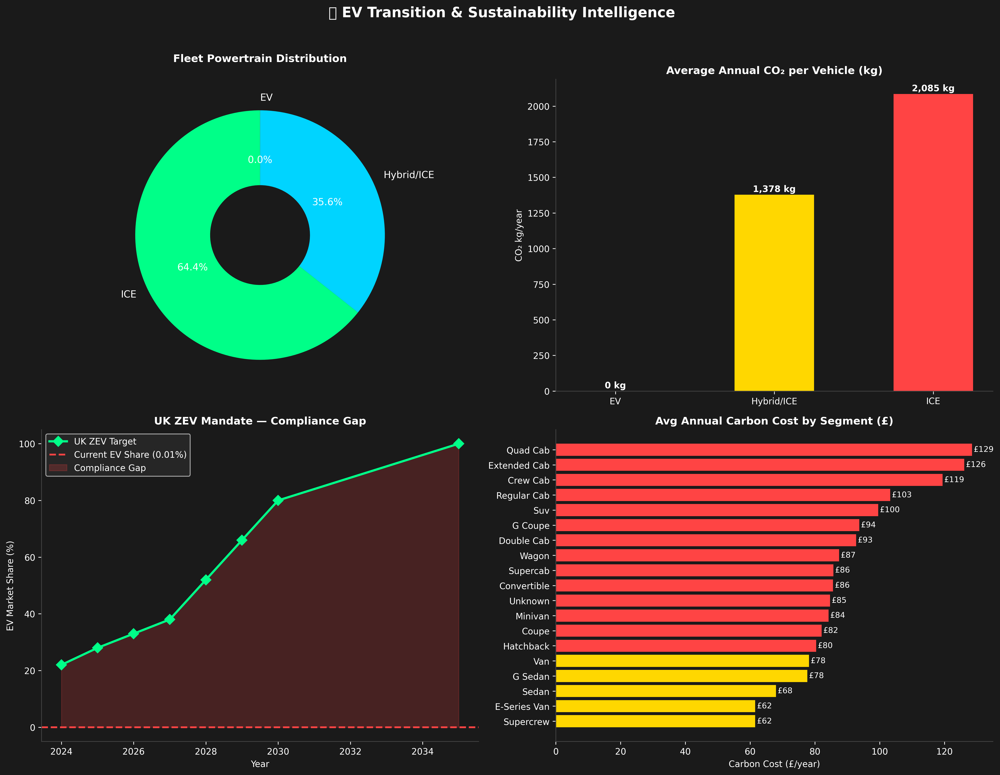

# Automotive R&D Intelligence — EV Transition & Sustainability Analytics

**Python | SQL | Machine Learning | Tableau | ESG Analytics**
[Live Tableau Dashboard](https://public.tableau.com/app/profile/neha.tg/viz/Automotive-RD-Intelligence/Dashboard1)

> Built on 558,837 real vehicle transactions. Gradient Boosting price prediction at 97.5% accuracy (R² = 0.975). UK ZEV compliance gap modelled at 32.99%.


## Overview

This project builds a production-grade analytics pipeline for automotive R&D covering data ingestion, validation, SQL-based KPI analysis, machine learning price prediction, and ESG sustainability modelling aligned to UK ZEV mandate targets.
It reflects the type of work I did during two years as a Data Engineer at Mercedes-Benz R&D India: building Python ETL pipelines over large-scale datasets, delivering KPI dashboards to cross-functional stakeholders, and validating data at enterprise scale. The difference here is the full stack is visible and reproducible.

---

## Key Findings

| Metric | Result |
|---|---|
| Raw records ingested | 558,837 vehicle transactions |
| Data quality after validation | 96.95% (541,798 clean records) |
| ML model accuracy (Gradient Boosting) | R² = 0.975 · RMSE = $1,527 |
| UK ZEV compliance gap identified | 32.99% behind mandate targets |
| ICE vs EV annual CO₂ delta modelled | 2,085 kg vs 0 kg per vehicle/year |

---




---

## Tech Stack

| What | Why |
|---|---|
| Python (Pandas, NumPy) | Data pipeline, cleaning, feature engineering |
| SQLite + SQL | KPI analysis, reconciliation, structured querying |
| Scikit-learn | Price prediction — tested Linear Regression, Random Forest, Gradient Boosting |
| Matplotlib, Seaborn | Exploratory charts, sustainability visualisations |
| Tableau Public | Interactive dashboard — live link above |
| Jupyter + VSCode | Development environment |

---

## Project Structure

```
automotive-rd-intelligence/
├── automotive_rd_intelligence.ipynb   # Full pipeline — run cells in order
├── brand_premium_index.csv            # KPI output: brand premium by manufacturer
├── carbon_sustainability.csv          # ESG output: CO₂ by powertrain type
├── condition_impact.csv               # KPI output: condition vs resale value
├── market_share_by_segment.csv        # KPI output: segment market share
├── price_depreciation.csv             # KPI output: depreciation by vehicle age
├── market_overview.png                # Dashboard export
├── ml_model.png                       # Model comparison chart
├── sustainability.png                 # CO₂ analysis chart
├── requirements.txt                   # Python dependencies
└── README.md
```

---

## Datasets

| Dataset | Size | Source |
|---|---|---|
| Vehicle Sales & Pricing | 558,837 transactions | Kaggle |
| Auto MPG & Engine Specs | 398 vehicles | Kaggle |
| Fuel Economy Data | Multi-year | fueleconomy.gov |
| UK EV Charging Statistics | Jan 2024 | UK Government |

---

## How to Run It

```
git clone https://github.com/NehaTG/automotive-rd-intelligence.git
cd automotive-rd-intelligence
pip install pandas numpy matplotlib seaborn scikit-learn jupyter
jupyter notebook automotive_rd_intelligence.ipynb
```

Run the cells in order — each section builds on the previous one.

---

## Background

I'm Neha, a Data Engineer and MSc Business Analytics candidate at the University of Surrey, Guildford, UK.

Before my MSc I spent two years as a Data Engineer at Mercedes-Benz R&D India, where I built Python automation pipelines, managed Azure data workflows, and handled reconciliation across 500,000+ records. I also co-invented a patent for an intelligent system for automated data-driven content transmission.

I am currently on a PSW (Graduate Route) visa. I can start work in the UK immediately with no sponsorship required for the duration of the visa. I am open to Skilled Worker visa sponsorship for longer-term roles.

tgneha05@gmail.com
LinkedIn: https://linkedin.com/in/neha-tg-04b615229
Guildford, UK

---

*If you have any questions about the methodology or want to talk through the project, feel free to reach out.*
